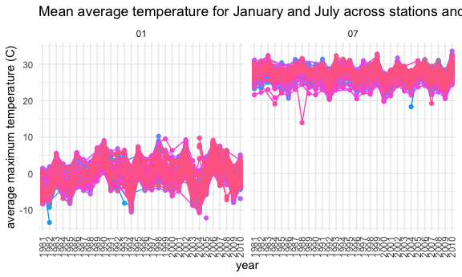

Homework 3
================
Amanda Warnock

``` r
library(tidyverse)
```

    ## ── Attaching packages ───────────────────────────────────────────────────────── tidyverse 1.3.0 ──

    ## ✓ ggplot2 3.3.2     ✓ purrr   0.3.4
    ## ✓ tibble  3.0.3     ✓ dplyr   1.0.2
    ## ✓ tidyr   1.1.2     ✓ stringr 1.4.0
    ## ✓ readr   1.3.1     ✓ forcats 0.5.0

    ## ── Conflicts ──────────────────────────────────────────────────────────── tidyverse_conflicts() ──
    ## x dplyr::filter() masks stats::filter()
    ## x dplyr::lag()    masks stats::lag()

``` r
library(p8105.datasets)
data("instacart")
library(p8105.datasets)
data("ny_noaa")
library(ggplot2)
library(ggridges)
library(patchwork)

knitr::opts_chunk$set(
  fig.width = 6,
  fig.asp = .6,
  out.width = "90%"
)

theme_set(theme_minimal() + theme(legend.position = "bottom"))

options(
  ggplot2.continuous.color = "viridis",
  ggplot2.continuous.fill = "viridis"
)

scale_color_discrete = scale_color_viridis_d
scale_fill_discrete = scale_fill_viridis_d
```

## Problem 1

``` r
data("instacart")
```

This dataset contains 1384617 rows and 15 columns.

Observations are the level of items in order by user. There are
user/order variables – user ID, order ID, order day, and order hour.
There are also item variables – name, aisle, department, and some
numeric codes.

How many aisles, and which are most items from?

``` r
instacart %>% 
  count(aisle) %>% 
  arrange(desc(n))
```

    ## # A tibble: 134 x 2
    ##    aisle                              n
    ##    <chr>                          <int>
    ##  1 fresh vegetables              150609
    ##  2 fresh fruits                  150473
    ##  3 packaged vegetables fruits     78493
    ##  4 yogurt                         55240
    ##  5 packaged cheese                41699
    ##  6 water seltzer sparkling water  36617
    ##  7 milk                           32644
    ##  8 chips pretzels                 31269
    ##  9 soy lactosefree                26240
    ## 10 bread                          23635
    ## # … with 124 more rows

There are 134 aisles, and the most items are from fresh vegetables.

Make a plot of only aisles with more than 10,000 items ordered.

``` r
instacart %>% 
  count(aisle) %>% 
  filter(n > 10000) %>% 
  mutate(
    aisle = factor(aisle), 
    aisle = fct_reorder(aisle, n)
  ) %>% 
  ggplot(aes(x = aisle, y = n)) +
  geom_point() +
  theme(axis.text.x = element_text(angle = 90, vjust = 0.5, hjust = 1))
```


Make a table for baking ingredients, dog food, and packaged
vegetables/fruits.

``` r
instacart %>% 
  filter(aisle %in% c("baking ingredients", "dog food care", "packaged vegetables fruits")) %>% 
  group_by(aisle) %>% 
  count(product_name) %>% 
  mutate(rank = min_rank(desc(n))) %>% 
  filter(rank < 4) %>% 
  arrange(aisle, rank) %>% 
  knitr::kable()
```

| aisle                      | product\_name                                 |    n | rank |
| :------------------------- | :-------------------------------------------- | ---: | ---: |
| baking ingredients         | Light Brown Sugar                             |  499 |    1 |
| baking ingredients         | Pure Baking Soda                              |  387 |    2 |
| baking ingredients         | Cane Sugar                                    |  336 |    3 |
| dog food care              | Snack Sticks Chicken & Rice Recipe Dog Treats |   30 |    1 |
| dog food care              | Organix Chicken & Brown Rice Recipe           |   28 |    2 |
| dog food care              | Small Dog Biscuits                            |   26 |    3 |
| packaged vegetables fruits | Organic Baby Spinach                          | 9784 |    1 |
| packaged vegetables fruits | Organic Raspberries                           | 5546 |    2 |
| packaged vegetables fruits | Organic Blueberries                           | 4966 |    3 |

apples vs ice cream

``` r
instacart %>% 
  filter(product_name %in% c("Pink Lady Apples", "Coffee Ice Cream")) %>% 
  group_by(product_name, order_dow) %>% 
  summarize(mean_hour = mean(order_hour_of_day)) %>% 
  pivot_wider(
    names_from = order_dow,
    values_from = mean_hour
  )
```

    ## `summarise()` regrouping output by 'product_name' (override with `.groups` argument)

    ## # A tibble: 2 x 8
    ## # Groups:   product_name [2]
    ##   product_name       `0`   `1`   `2`   `3`   `4`   `5`   `6`
    ##   <chr>            <dbl> <dbl> <dbl> <dbl> <dbl> <dbl> <dbl>
    ## 1 Coffee Ice Cream  13.8  14.3  15.4  15.3  15.2  12.3  13.8
    ## 2 Pink Lady Apples  13.4  11.4  11.7  14.2  11.6  12.8  11.9

## Problem 2

Load, tidy, and wrangle data. Pivot longer to add rows minute of the day
and activity count

``` r
accel_df = read_csv(file = "./data/accel_data.csv") %>% 
  janitor::clean_names()
```

    ## Parsed with column specification:
    ## cols(
    ##   .default = col_double(),
    ##   day = col_character()
    ## )

    ## See spec(...) for full column specifications.

``` r
accel_tidy = 
  pivot_longer(
    accel_df,
    activity_1:activity_1440,
    names_to = "minute",
    values_to = "activity_count"
  ) %>% 
  mutate(day_category = recode(day, Monday = "weekday", Tuesday = "weekday", Wednesday = "weekday", Thursday = "weekday", Friday = "weekday", Saturday = "weekend", Sunday = "weekend")) %>% 
  relocate(day_category, .after = day) %>% 
  mutate(day = as.factor(day)) %>% 
  mutate(day_category = as.factor(day_category))

accel_tidy
```

    ## # A tibble: 50,400 x 6
    ##     week day_id day    day_category minute      activity_count
    ##    <dbl>  <dbl> <fct>  <fct>        <chr>                <dbl>
    ##  1     1      1 Friday weekday      activity_1            88.4
    ##  2     1      1 Friday weekday      activity_2            82.2
    ##  3     1      1 Friday weekday      activity_3            64.4
    ##  4     1      1 Friday weekday      activity_4            70.0
    ##  5     1      1 Friday weekday      activity_5            75.0
    ##  6     1      1 Friday weekday      activity_6            66.3
    ##  7     1      1 Friday weekday      activity_7            53.8
    ##  8     1      1 Friday weekday      activity_8            47.8
    ##  9     1      1 Friday weekday      activity_9            55.5
    ## 10     1      1 Friday weekday      activity_10           43.0
    ## # … with 50,390 more rows

This dataset includes five weeks of activity data for every minute of
the five weeks from an accelerometer used by a 63-year old man. The
variables included are week, day\_id, day, day\_category, minute,
activity\_count. ‘Day\_category’ defines whether the day is a weekday or
weekend. ‘Minute’ defines which minute of the day the activity occurred
starting at midnight, and ‘activity\_count’ includes a count of the
activity in that minute. The dataset has 50400 rows and 6 columns.

Create a total activity table for each day.

``` r
accel_tidy %>% 
  group_by(day, week) %>% 
  summarize(sum_count = sum(activity_count)) %>% 
  pivot_wider(
    names_from = day,
    values_from = sum_count
  ) %>% 
  relocate(Tuesday, .after = Monday) %>% 
  relocate(Friday, Saturday, Sunday, .after = Thursday) %>% 
  relocate(Wednesday, .before = Thursday)
```

    ## `summarise()` regrouping output by 'day' (override with `.groups` argument)

    ## # A tibble: 5 x 8
    ##    week  Monday Tuesday Wednesday Thursday  Friday Saturday Sunday
    ##   <dbl>   <dbl>   <dbl>     <dbl>    <dbl>   <dbl>    <dbl>  <dbl>
    ## 1     1  78828. 307094.   340115.  355924. 480543.   376254 631105
    ## 2     2 295431  423245    440962   474048  568839    607175 422018
    ## 3     3 685910  381507    468869   371230  467420    382928 467052
    ## 4     4 409450  319568    434460   340291  154049      1440 260617
    ## 5     5 389080  367824    445366   549658  620860      1440 138421

The person is the least active on Saturdays of week 4 and 5. He is the
most active on the Monday of the third week.

Make a single-panel plot that shows the 24-hr activity time courses over
each day.

``` r
accel_tidy %>% 
  ggplot(aes(x = minute, y = activity_count, group = day, color = day)) +
  geom_line(alpha = .3) +
  geom_smooth(aes(group = day), se = FALSE)
```

    ## `geom_smooth()` using method = 'gam' and formula 'y ~ s(x, bs = "cs")'


He tends to be less active at night than during the day. He has activity
peaks on Friday and Sunday. Other days tend to be fairly steady.

\#\#Problem 3

This data is from the National Oceanic and Atmospheric Association,
which provides summary statistics on weather stations, among other
public weather information. This dataset is limited to weather data for
five core variables from New York from January 1, 1981 to December 31,
2010. Variables included in this set are id, date, prcp, snow, snwd,
tmax, tmin. *prcp* is precipitation in tenths of mm, *snow* is snowfall
in mm, *snowd* is snow depth in mm, *tmax* is the maximum temperature in
tenths of degrees C, and *tmin* is the minimum temperature in tenths of
degrees C. It has 2595176 rows and 7 columns. There is extensive missing
data, especially due to some stations not reporting at all and some
frequently not reporting temperatures.

Create separate variables for day, month, and year.

``` r
ny_noaa = 
  ny_noaa %>% 
  separate(date, into = c("year", "month", "day"), sep = "-")
```

Look at units for precipitation, snowfall, and temperature. All are
given in mm or tenths of C, which are not reasonable units. Change to
reasonable units. Find what the most commonly observed snowfall values
are and why.

``` r
ny_noaa = 
  ny_noaa %>% 
  mutate(
    prcpcm = prcp/100, 
    snowcm = snow/10,
    snwdcm = snwd/10,
    tmax = as.numeric(tmax),
    tmin = as.numeric(tmin),
    tmaxd = tmax/10,
    tmind = tmin/10)
  
ny_noaa %>% 
  group_by(snowcm) %>% 
  count() %>% 
  arrange(desc(n))
```

    ## # A tibble: 282 x 2
    ## # Groups:   snowcm [282]
    ##    snowcm       n
    ##     <dbl>   <int>
    ##  1    0   2008508
    ##  2   NA    381221
    ##  3    2.5   31022
    ##  4    1.3   23095
    ##  5    5.1   18274
    ##  6    7.6   10173
    ##  7    0.8    9962
    ##  8    0.5    9748
    ##  9    3.8    9197
    ## 10    0.3    8790
    ## # … with 272 more rows

The first most common value is 0, which occurs 2,008,508 times in the
set, due to most days not having snowfall. The second most common is NA,
which occurs 381,221 times, due to the large amount of missingness in
the set. The third most common is 2.5cm, which occurs 31,022 times.

Make 2-panel plot of average max temps for January and July in each
station across years. Filter, groupby, summarize, and make plot.

``` r
ny_noaa %>% 
  filter(month %in% c("01", "07")) %>% 
  group_by(id, year, month) %>% 
  summarize(avtmaxd = mean(tmaxd, na.rm = TRUE)) %>% 
  ggplot(aes(x = year, y = avtmaxd, group = id, color = id)) +
  geom_point() + 
  geom_path() +
  facet_grid(~ month) + 
  labs(title = "Mean average temperature for January and July across stations and years", x = "year", y = "average maximum temperature (C)") +
  theme(axis.text.x = element_text(angle = 90, vjust = 0.5, hjust = 1)) +
  theme(legend.position = "none")
```

    ## `summarise()` regrouping output by 'id', 'year' (override with `.groups` argument)

    ## Warning: Removed 5970 rows containing missing values (geom_point).

    ## Warning: Removed 5931 row(s) containing missing values (geom_path).


Overall, all of the average maximum temperatures in January are lower
than all of teh temperatures in July. There are a couple outliers,
including two especially low values in January (1982 and 2005) and one
in July (1988). Despite a slight dip in the late 2000s, a the
temperature overall rises across the years in January, a potential mark
of climate change.

Make a two-panel plot for max and min temps and make a plot showing the
distribution of snowfall \>0 and \<100 separately by year.

``` r
hex_noaa = 
  ny_noaa %>% 
  ggplot(aes(x = tmind, y = tmaxd)) + 
  geom_hex() +
  labs(title = "Maximum and Minimum temperatures (C)", x = "Minimum temperature (C)", y = "Maximum temperature (C)")

density_noaa = 
  ny_noaa %>% 
  filter(snowcm < 100, snowcm > 0) %>% 
  ggplot(aes(x = snowcm, y = year)) +
  geom_density_ridges() +
  labs(title = "Distribution of snowfall between 0 and 100 cm", x = "Snowfall (cm)", y = "Year")

hex_noaa + density_noaa
```

    ## Warning: Removed 1136276 rows containing non-finite values (stat_binhex).

    ## Picking joint bandwidth of 0.622


Most minimum temperatures fall between -45 and 35 degrees C. Most
maximum temperatures fall between -32 and 45 degrees C. The bulk of
snowfall fell between 0 and 12 cm.
